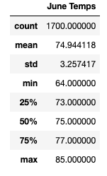
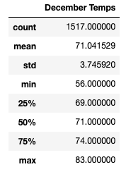

# Surfs Up - Weather Analysis

### Analysis of June and December Temperatures in Oahu, Hawaii 
---

## Overview

The purpose of this analysis is to determine if the weather in Oahu, Hawaii is conducive to a year round ice cream business. This was achieved by examining weather patterns and June and December. The following will outline the summary statistics of the weather in June and December, describe three key differences between the weather in June and December, and conclude with a high level summary of the results with additional suggestions for analysis. 

## Results

**Figure 1.1** and **Figure 1.2** show June the summary statistics for OahuÕs weather in June and December, respectively. 

**Figure 1.1**

 

**Figure 1.2**

 

Three key differences in Oahu's weather between June and December are listed below. 
* First, the mean temperature in June is approximately four degrees higher than the mean temperature in December. 
* Second, the standard deviation of temperatures in December is 0.49 higher than it is in June. 
* Third, the minimum temperature in December is 56 degrees, whereas it is 64 degrees in June. 

## Summary

There is insight to be found in the key differences between December and JuneÕs weather listed above. On average, June is warmer than December, making it better suited to ice cream sales. The larger standard deviation seen in our December weather data suggest that the weather in that month is more erratic. This is confirmed by the minimum temperature of 56 degrees we see in December, versus 64 degrees in June. There is only a two degree difference between the maximum temperature of the two months, so it is safe to assume that DecemberÕs larger standard deviation is caused by drops in temperature. One additional query that could improve our analysis would be to examine DecemberÕs weather by day. This could allow us to see if there are temperature drops occurring at a certain time of month, when the ice cream shop should close. A second query that could improve our analysis would be one that accounts for cloud cover. Ice cream sells better in the sun and cloud cover could be disadvantageous in either month, even if the temperatures are good. 

